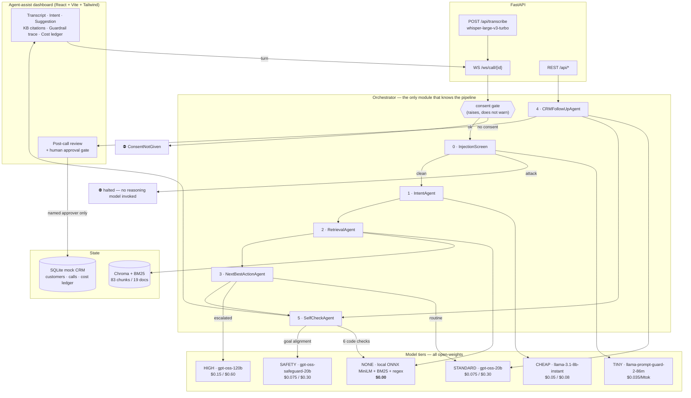

# SahAI — Architecture

An AI voice co-pilot for inside-sales agents selling a pay-in-3, zero-cost EMI
product. Six specialised agents, cost-tiered across five open-weights models,
with eight guardrails — six of which are deterministic code rather than prompt
instructions.

Measured end-to-end: **$0.0032 per assisted call, a 57× cost reduction** against
the same token volume through a single frontier-model mega-prompt.

---

## 1. Provider note

The build brief specified Claude for high-stakes reasoning. A Groq key was
supplied instead, so the stack runs entirely on **open-weights models served by
Groq**. Flagging the deviation explicitly.

It turned out to be a better fit for two of the brief's own principles:

- *"Show that a smaller open-source model, RAG, or a classical solver could
  replace constant calls to an expensive commercial LLM"* — this is no longer a
  side-demo, it is the architecture. Every model here is open-weights.
- Groq serves **purpose-built safety models** (`gpt-oss-safeguard-20b`,
  `llama-prompt-guard-2-86m`), which makes the guardrail layer a genuine
  specialist rather than a general model wearing a compliance prompt.

The provider is isolated behind `app/llm/client.py`. Swapping back to Claude, or
to anything else, is a one-file change.

---

## 2. System diagram



---

## 3. The six agents

Each owns exactly one decision, declares its tier, and speaks only in the
Pydantic contracts in `app/schemas.py`. **No agent imports another.** The
orchestrator wires them. That constraint is what makes this a set of cooperating
specialists rather than one prompt with headings — each can be tested, swapped
or re-tiered in isolation.

| # | Agent | Tier | Decision |
|---|---|---|---|
| 0 | `InjectionScreen` | TINY | Is this utterance a manipulation attempt? |
| 1 | `IntentAgent` | CHEAP | Intent, entities, drop-off risk |
| 2 | `RetrievalAgent` | **NONE** | Which KB chunks ground this turn? *(no LLM)* |
| 3 | `NextBestActionAgent` | STANDARD → HIGH | What should the human say next? |
| 4 | `CRMFollowUpAgent` | STANDARD | Summary, CRM patch, follow-up draft |
| 5 | `SelfCheckAgent` | NONE → SAFETY/HIGH | Is this output safe to surface? |

### Contracts

```
ScreenIn      → ScreenOut     { is_attack, score }
IntentIn      → IntentOut     { intent, confidence, entities, dropoff_risk,
                                sentiment, buying_signals[], escalate }
RetrievalIn   → RetrievalOut  { citations[], facts[], dropped_stale[] }
NBAIn         → NBAOut        { say, why, action_type, cited_chunk_ids,
                                requires_human_confirmation }
CRMIn         → CRMOut        { summary, crm_patch, disposition, dropoff_reason,
                                questions_asked[], objections[], interest_level,
                                conversion_probability, conversion_rationale,
                                followup_timing, sentiment, followup_draft,
                                send_status }
CheckIn       → CheckOut      { passed, checks[], redacted_say, blocked_reason }
```

`GroundedFact` cannot be constructed without a `chunk_id`. An ungrounded claim
is not representable in the type system.

---

## 4. Cost tiering

`app/llm/router.py`. Escalation rules are Python predicates, not prompt text —
a model cannot talk its way into a cheaper tier on a sensitive turn, and every
escalation carries a named trigger that lands in the ledger and the UI.

| Rule | Fires when |
|---|---|
| `sensitive_intent` | intent ∈ {eligibility, objection_cost, objection_trust, **complaint**, **payment_issue**} |
| `credit_terms_in_context` | customer's words match regulated credit terminology |
| `high_dropoff_risk` | drop-off risk > 0.60 |
| `low_intent_confidence` | intent confidence < 0.60 |
| `negative_sentiment` | customer sounds angry or frustrated |
| `agent_requested` | human asked for a second opinion |

A caller with a problem is the easiest person to lose and the hardest turn to
get right — the correct move is usually to *stop selling* and route them, which
is exactly what a cheap model gets wrong. Same reasoning for negative sentiment:
a cheap model reaches for a script at the moment a script is most damaging.

**`llama-3.3-70b-versatile` is deliberately excluded.** At $0.59/$0.79 it is 4×
the input cost of `gpt-oss-120b` ($0.15/$0.60), which is also the stronger
reasoner. Dominated on both axes.

### Three cost levers, not one

1. **Tiering** — cheap by default; expense is opt-in and must be justified by a rule.
2. **RAG instead of inference** — retrieval is the highest-frequency step in the
   pipeline and costs **$0.00**. Six of eight guardrails likewise.
3. **`reasoning_effort`** — the gpt-oss models bill chain-of-thought as output
   tokens. Measured on an identical NBA prompt: `low` = 150 completion tokens,
   `medium` = 334. 2.2× the cost for the same answer on a well-specified task.

### Two bugs worth recording

Both were found by running the pipeline and reading the ledger, not by review.

**Escalation on KB text.** The first version fed retrieved chunks into the
credit-terms rule. Sounds reasonable; badly wrong — this is a credit product, so
*every* chunk mentions fees or eligibility, the rule fired on ~90% of turns, and
the tiering it was meant to justify silently evaporated. Scoping the rule to the
customer's own words cut cost 25% (`$0.00431 → $0.00324`) and moved the
reduction from 47.5× to 57.2×.

**Reasoning tokens exhausting `max_tokens`.** `gpt-oss-120b` in JSON mode spent
its whole budget reasoning and failed with `json_validate_failed` before closing
the object. Fixed with headroom, `reasoning_effort=low`, and a retry ladder in
`_call_with_retry` that degrades to a slower answer rather than a crash.

---

## 5. Guardrails

Eight checks. **Six are deterministic Python.** Each result carries
`enforced_by`, which the dashboard renders distinctly — a reviewer can see which
parts of the safety story survive an adversarial customer.

| Check | By | Rule |
|---|---|---|
| `consent_recorded` | **code** | Orchestrator *raises* `ConsentNotGiven`. There is no code path that processes a turn without consent. |
| `injection_screen` | llm (86M) | Attack utterances never reach a reasoning model. |
| `grounding` | **code** | Every figure in the suggestion must appear in a cited chunk. Set membership, not judgement. |
| `no_autonomous_credit_terms` | **code** | Human-confirmation flag can be raised by code, never lowered by the model. |
| `pii_redaction` | **code** | Aadhaar / PAN / card / phone / OTP / email masked everywhere. |
| `no_stale_terms` | **code** | Chunks outside their validity window are dropped at retrieval. |
| `goal_alignment` | llm (safeguard) | Policy adjudication against the written business goals. |

Design points:

- **Code checks run first and short-circuit.** A failed deterministic check never
  reaches a paid model.
- **Internal vs customer-facing.** A CRM summary gets every code check but is
  *not* judged by the customer-facing conduct policy. Reviewing an internal note
  under "did you ask for an OTP?" produced confident nonsense — it flagged a note
  recording that *the customer completed the OTP step*.
- **Human oversight is a state machine.** `SendStatus` starts at
  `pending_agent_approval`; only `POST /api/calls/{id}/approve`, with a named
  approver, advances it. No agent can reach that endpoint.
- **Opt-out suppression is code.** An explicit opt-out or a `do_not_call` flag
  means no follow-up is drafted at all — TRAI compliance, not model discretion.

The seed KB deliberately contains an **expired 2024 fee schedule**. When a
customer says "my friend said there's a ₹199 processing fee", those chunks rank
highly and are dropped — the negative test case runs in the demo.

---

## 6. RAG

Hybrid: local ONNX **all-MiniLM-L6-v2** via Chroma + **BM25**, fused with
reciprocal rank fusion (no score normalisation needed between them).

Embeddings alone are weak on exact tokens like "₹250", "PAN", or "199" —
precisely the terms a fintech agent must quote correctly. BM25 catches those;
vectors catch paraphrase ("what's the catch" → hidden charges).

83 chunks from 19 documents. Chunking is heading-aware and carries
`effective_from` / `effective_to` per chunk so staleness is knowable at
retrieval time, not answer time.

> `chromadb` ships an ONNX MiniLM embedder via `onnxruntime` (~80MB), so we get
> local embeddings **without** pulling in torch (~2GB). Deliberate.

---

## 7. Stack

| Layer | Choice | Why |
|---|---|---|
| Backend | FastAPI + Pydantic v2 | Contracts are the design; Pydantic makes them executable |
| Orchestration | ~230 LOC custom async | A 6-node DAG does not need LangGraph. Judges must *read* the pipeline |
| Vector store | Chroma (local, persisted) | Clean install on Windows/Py3.10, zero paid infra |
| Lexical | `rank-bm25` | Exact-token recall on fees and IDs |
| LLM | Groq (`groq` SDK behind `llm/client.py`) | Provider swap is one file |
| STT | `whisper-large-v3-turbo` | $0.04/hr — ~$0.003 for a 5-min call |
| CRM | SQLite + SQLAlchemy 2.0 | Mock, but a real state machine |
| Frontend | React 18 + Vite 6 + Tailwind 3 | Fast, and the tier colours carry the cost story |

---

## 8. Scope decisions (flagged, not silent)

| Decision | Choice | Rationale |
|---|---|---|
| Audio | **Three paths**: live mic, audio upload, scripted playback | All run the identical pipeline and consent gate. Playback stays the safe demo route; the voice paths are real. See §10. |
| Speaker diarisation | **Not attempted** — the UI asks | One mic can't separate voices and Whisper doesn't diarise. A wrong guess silently poisons intent on every later turn; an explicit toggle is honest and correct. |
| TTS provider | Browser speech synthesis | Free, offline, zero added latency. A co-pilot in an earpiece doesn't need a studio voice. |
| Live-call state | In-process dict | One process for a hackathon. Production needs Redis so any worker can serve the socket. Called out, not hidden. |
| Deploy | Local only | Per brief. |
| Local kNN intent classifier | **Not built** | With the whole stack already on open-weights models, the "smaller model replaces an expensive LLM" principle is satisfied architecturally. It would have been a demo, not a design. |

---

## 9. Voice

```
mic ──► Web Audio RMS ──► VAD: silence > 900ms ──► stop recorder
                                                        │
                                            complete .webm utterance
                                                        │
                                          WS /ws/live/{id} (binary frame)
                                                        │
                                        whisper-large-v3-turbo ($0.04/hr)
                                                        │
                                         currency normalisation + PII redact
                                                        │
                                        ── the same orchestrator as scripted ──
                                                        │
                              assist ──► dashboard  +  optional speech synthesis
```

**Segmentation, not chunking.** Only the *first* chunk of a MediaRecorder
stream carries the webm header; later chunks are not independently decodable and
Whisper rejects them. The recorder is therefore stopped and restarted at each
silence boundary, yielding complete self-contained files. Segmenting on silence
rather than a timer also makes each utterance map 1:1 onto a pipeline turn —
identical in shape to the scripted path, so nothing downstream changes.

Guards on the boundary detector: utterances under 400ms are dropped (coughs,
clicks), a monologue is force-cut at 20s so the agent still gets help mid-flow,
and transcripts under 3 characters are discarded because Whisper hallucinates
filler ("Thank you.", "Bye.") on near-silent clips — which would otherwise enter
conversation history and skew intent on every later turn.

### The STT failure that mattered

Whisper rendered *"a one ninety nine processing fee"* as **"a $1.99 processing
fee"** — wrong currency and wrong magnitude. Grounding matches figures against
retrieved chunk text, so a mis-transcribed amount matches nothing (a wasted
turn) or the wrong thing (worse).

Two mitigations, both cheap and both upstream of any reasoning model:

1. **Domain priming.** A prompt naming rupees, Indian spoken-number forms, and
   the product vocabulary. Measured on the same clip: `$1.99` → `199`.
2. **Currency normalisation.** `$` amounts rewritten as rupees, hyphenated
   spoken numbers joined (`1-99` → `199`). This product quotes no USD anywhere,
   so a dollar sign in a transcript is always an artefact.

Neither is a guarantee, and they are not presented as one — recognition on
numbers is probabilistic and varies between runs on identical audio. **The
safety property is downstream:** a figure that survives mis-transcription still
cannot be quoted to a customer, because grounding won't match it. The
normalisations reduce how often a good turn is wasted; grounding is what stops a
bad one reaching a human.

---

## 10. Telephony

```
customer's phone ──► carrier ──► TwiML webhook ──► session + consent on record
                                                          │
                          <Say> disclosure, then <Start><Stream both_tracks>
                                                          │
                        wss /ws/telephony/stream ── base64 G.711 mu-law, 20ms
                                                          │
                          per-leg buffers: inbound=customer, outbound=agent
                                                          │
                                 server VAD ──► mu-law → PCM16 → WAV
                                                          │
                                                       Whisper
                                                          │
                                       ── the same orchestrator ──
                                                          │
                       publish ──► ws /ws/observe/{id} ──► agent dashboard
```

**Speaker attribution is exact here.** The carrier keeps the two call legs
separate and labels every frame `inbound` or `outbound`, so the system knows who
spoke without asking. This is the one thing a phone call gives that a single
laptop microphone cannot — the browser path has to expose a manual toggle
because one mic cannot separate voices and Whisper does not diarise.

**The dashboard observes rather than drives.** A phone call is driven by the
carrier's socket, so the browser is not in the audio path at all — which is what
makes it work when the agent is on a desk phone or a softphone. `/ws/observe`
replays the backlog on attach, so a dashboard opened mid-call is not missing the
turns that already happened.

**`<Start>` not `<Connect>`.** `<Connect><Stream>` hands the call to the socket
and expects audio back; that is a voice bot. `<Start><Stream>` forks a copy while
the call proceeds normally between the two humans. A co-pilot advises the agent
and never speaks to the customer, and the choice of TwiML verb is what enforces
that at the platform level.

**Codec handling is pure Python.** `audioop` is the obvious route and is
**removed in Python 3.13**, so depending on it would break the project on a newer
interpreter; numpy would be a heavy dependency for a 256-entry lookup table and
an RMS loop. `app/telephony/audio.py` has no third-party dependency.

### Two ordering bugs found by running it

**Sentence pauses fragmenting one question.** At a 700ms silence threshold, "I
don't believe the zero-cost thing. My friend said there's a fee. Is that true?"
arrived as three turns — three transcriptions, three pipeline runs, three
suggestions, only the last of which answered the question. Raised to 900ms to
match the browser VAD.

**Concurrent transcription scrambling the transcript.** Utterances were
transcribed as fire-and-forget tasks, and because latency varies by clip they
completed out of order: "My friend told me…" landed *before* "Honestly I don't
believe…". Not cosmetic — conversation history feeds the intent classifier on
every turn and the summariser at the end. Now serialised behind a per-call lock;
utterances are naturally spaced by the speaker pausing, so the queueing cost is
small next to a transcript that reads backwards.

---

## 11. Repository map

```
backend/app/
├─ schemas.py        ← all agent contracts; read this first
├─ orchestrator.py   ← the only module that knows the pipeline shape
├─ config.py         model tiers, pricing table, business goals
├─ main.py           FastAPI: REST + WS + Whisper + approval gate
├─ llm/
│  ├─ client.py      Groq wrapper, usage capture, retry ladder, STT + priming
│  └─ router.py      escalation rules (code, not prompt)
├─ rag/
│  ├─ ingest.py      markdown → chunks → Chroma + BM25
│  └─ retriever.py   hybrid search, staleness filtering
├─ agents/           injection · intent · nba · crm · selfcheck (+ base)
├─ guardrails/
│  ├─ pii.py         regex redaction
│  └─ rules.py       the five deterministic checks
├─ crm/              SQLAlchemy models + the approval write path
├─ telemetry/cost.py per-decision ledger
├─ telephony/
│  ├─ audio.py       G.711 mu-law codec, WAV packaging, server-side VAD
│  └─ twilio.py      TwiML generation, Media Streams parsing, signature check
└─ seed/             18 KB docs · 4 transcripts · audio clips · CRM seeder

backend/simulate_phone_call.py   replays a WAV as a real inbound call
```
